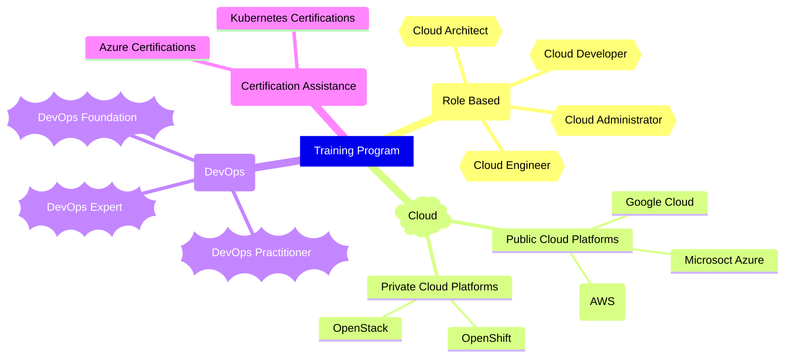

# Cloud Native Hero Trainings

## Training Offerings

### Role Based
- [Cloud Developer](./content/role/dev/README.md)
- [Cloud Administrator](./content/role/admin/README.md)
- [Cloud Engineer](./content/role/engg/README.md)
- [Cloud Architect](./content/role/arch/README.md)

### Cloud Platform
- Public Cloud Platforms
  - [Microsoft Azure](./content/cloud/pub/azure/README.md)
  - [Amazon Web Services (AWS)](./content/cloud/pub/aws/README.md)
  - [Google Cloud](./content/cloud/pub/google/README.md)
- Private Cloud Platforms
  - [OpenStack](./content/cloud/priv/openstack/README.md)
  - [OpenShift](./content/cloud/priv/openshift/README.md)
### DevOps
- [DevOps Foundation](./content/devops/foundation/README.md)
- [DevOps Practitioner](./content/devops/practitioner/README.md)
- [DevOps Expert](./content/devops/expert/README.md)

### Certification Assistance
- [Kubernetes Certifications](./content/certprep/k8s/README.md)
- [Azure Certifications](./content/certprep/azure/README.md)